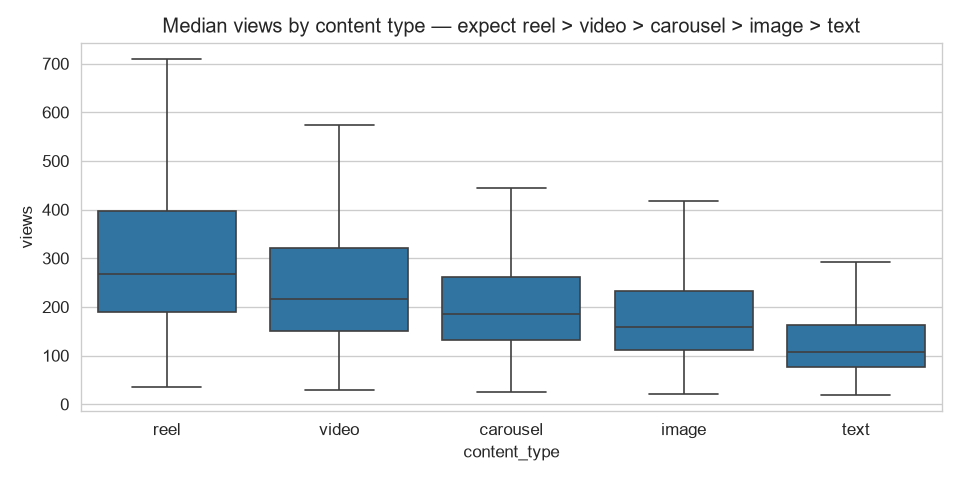
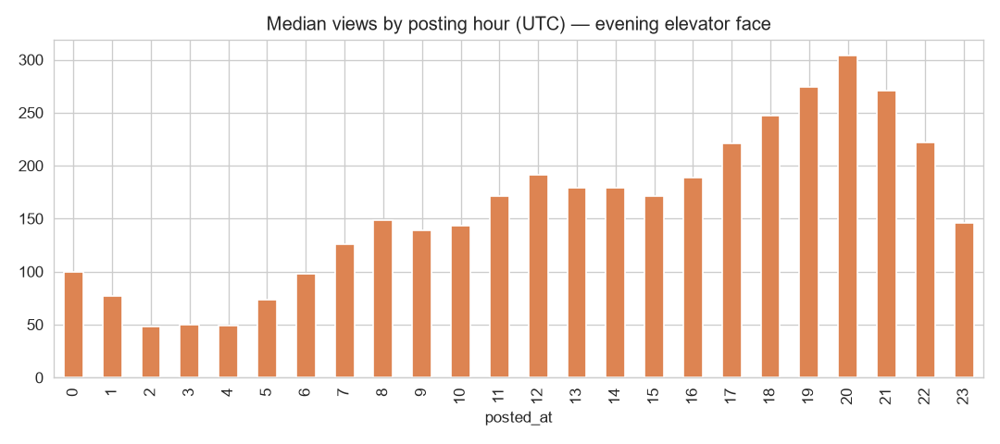
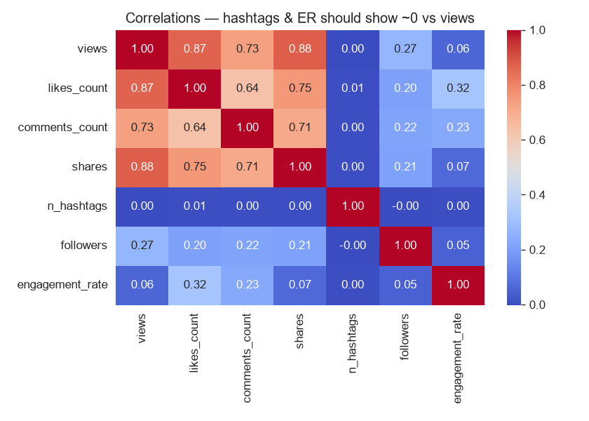
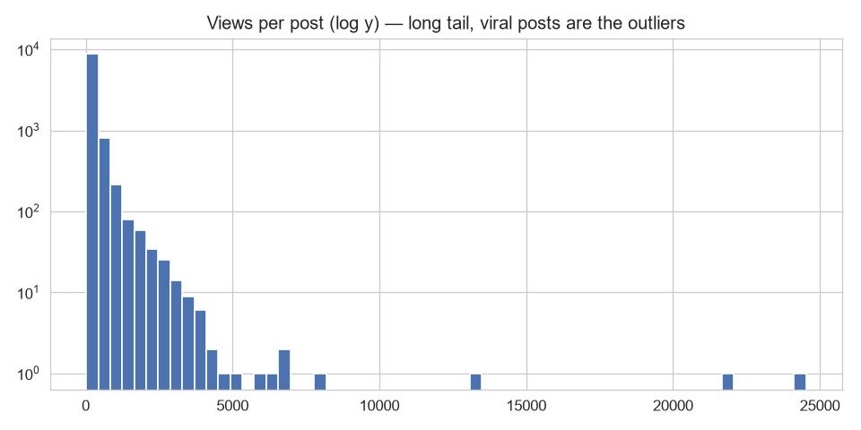
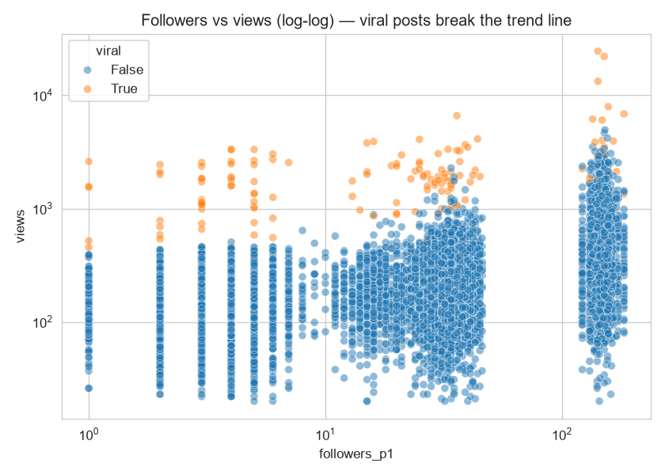
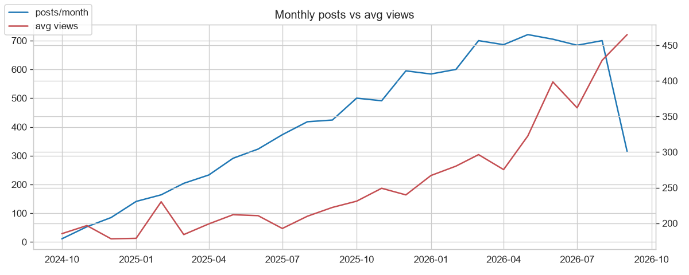
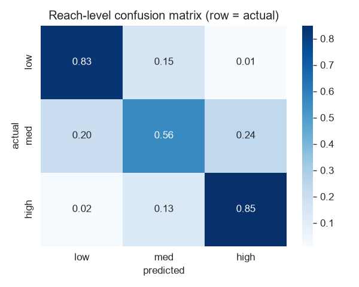
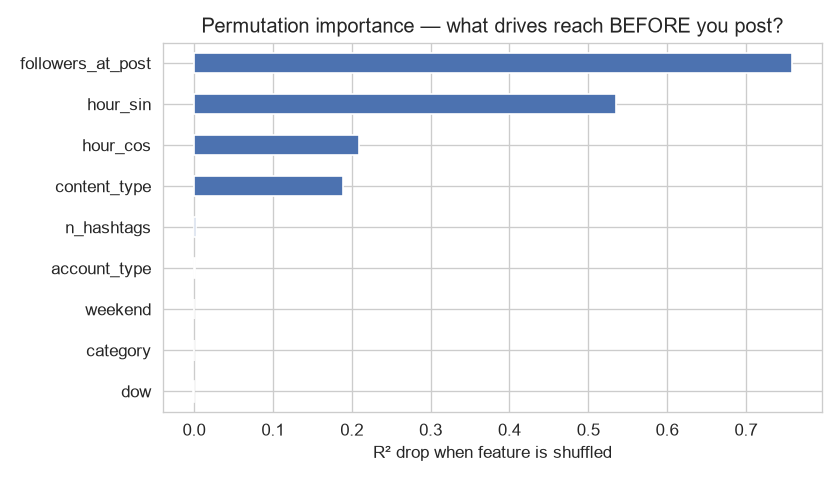

# 📊 Social Media Analytics — MongoDB → Aggregation → EDA → Machine Learning

> An end-to-end data project: I built a **statistically realistic social-media dataset** (161K documents),
> mined it with **MongoDB aggregation pipelines**, explored it with **pandas**, and trained **ML models**
> to predict post reach — with leakage controls, temporal validation, and honest null results.

---

## 🔍 What this project is

Most "MongoDB portfolio projects" stop at CRUD. This one treats the database as the foundation of an
actual analytics workflow:

| Stage | File | What it does |
|---|---|---|
| 1 · Data generation | `generate_data.py` | Simulates a social platform: users, follower network, posts, likes, comments |
| 2 · Aggregation analytics | `analytics.py` | 8 MongoDB pipelines — `$group`, `$lookup`, `$unwind`, `$cond`, `$facet` |
| 3 · EDA | `eda.py` | pandas + seaborn: distributions, correlations, trends |
| 4 · Machine learning | `ml.py` | Reach prediction with leakage controls + temporal validation |

## ⚙️ Architecture

```
        Synthetic Data Generator (Python + Faker)
     correlated, not random — fixed seeds, fully reproducible
                        │
                        ▼
        ┌─────────────────────────────┐
        │      MongoDB (9.0.2)        │
        │  users · posts · comments   │
        │  likes · followers          │
        └──────────────┬──────────────┘
                       ▼
          Aggregation Pipelines ($match/$group/
          $lookup/$unwind/$facet)  →  analytics.py
                       │
                       ▼
             pandas DataFrame  →  eda.py
                │                   │
                ▼                   ▼
        EDA + Visualization    Cross-validation of
        (8 charts)             MongoDB results
                       │
                       ▼
        Machine Learning (scikit-learn)  →  ml.py
        reach regression + 3-class classification
```

## 🗄️ The dataset

**161,000 documents · Oct 2024 → Oct 2026 · fully reproducible (seed 42)**

| Collection | Docs | Key fields |
|---|---|---|
| `users` | 1,000 | account_type (regular 58% / creator 25% / business 11% / influencer 6%), country, joined_at, derived follower counts |
| `followers` | 20,000 | follower → following edges with timestamps (no self-follows, no duplicates) |
| `posts` | 10,000 | content_type, category, hashtags[], posted_at, views, likes_count, comments_count, shares, engagement_rate, viral flag |
| `likes` | 100,000 | unique (user, post) pairs with timestamps |
| `comments` | 30,000 | text + sentiment (positive/neutral/negative) |

**Headline stats:** 2.86M total views · 3.49% like rate · 1.05% comment rate · 160 viral posts (1.6%) · top post 24,523 views vs 189 median (~130×)

### What makes this dataset different: it's correlated, not random

Every number was *generated from* other numbers, so the analysis has real structure to discover:

- **Followers → reach:** a post's views depend on the author's followers **as of the post date**
  (chronological network sweep — not the final count)
- **Content type → reach:** multipliers (reel 1.5× … text 0.6×) produce measurable differences
- **Time of day → reach:** evening posts (18–20h) get up to 6× the reach of 3–4am posts
- **Viral outliers:** ~1.6% of posts break the pattern with 5–15× reach
- **Sentiment ↔ reception:** comment sentiment shifts with how well a post performed
- **Zero contradictions:** denormalized counts are derived from the actual interaction documents;
  interaction timestamps always respect join dates

## 📁 Repository structure

```
social-media-analytics/
├── generate_data.py     # dataset generator (5 collections, exact totals)
├── analytics.py         # 8 MongoDB aggregation pipelines
├── eda.py               # pandas EDA → reports/01–06
├── ml.py                # ML models + results section → reports/07–08
├── requirements.txt
└── reports/             # all charts (committed)
```

## ▶️ How to run

```bash
pip install -r requirements.txt          # pymongo, faker, pandas, numpy, matplotlib, seaborn, scikit-learn
python generate_data.py                  # builds social_media_analytics (drops + rebuilds)
python analytics.py                      # aggregation analytics
python eda.py                            # EDA + charts
python ml.py                             # ML + results
```

Requires a local MongoDB instance (`mongodb://localhost:27017/`); explore it with MongoDB Compass.

---

## 2️⃣ MongoDB aggregation analytics

Eight pipelines answered the platform's core questions in milliseconds:

| # | Question | Pipeline | Answer |
|---|---|---|---|
| 1 | Best content type? | `$group` | reel 392 > video 326 > carousel 258 > image 237 > text 168 avg views |
| 2 | When to post? | `$hour` | 20:00 → 450 avg views; 3–4am → ~70 (**6.4× spread**) |
| 3 | Hashtag reach? | `$unwind` + `$group` | top-10 tags all within 477K–542K views → **no real effect** |
| 4 | Viral vs normal | `$group` | viral = reach outlier, **not** higher engagement rate |
| 5 | Creator leaderboard | `$lookup` | top 10 by total engagement are all influencers |
| 6 | Sentiment ↔ reception | `$lookup` comments→posts | cold 45.7% → warm 59.2% → hot 63.7% positive |
| 7 | Dashboard KPIs | `$facet` | 4 result sets in **one 87 ms round-trip** |

```
▸ kpis   {'posts': 10000, 'total_views': 2866812, 'avg_er': 0.0456}
▸ by_content_type   reel 392 · video 326 · carousel 258 · image 237 · text 168
▸ top_posts         post 7774 (video, viral) · 24,523 views
▸ top_categories    0.0457 – 0.0471  → flat, by design
```

## 3️⃣ Exploratory analysis (pandas)




**Key findings:**

- **Reach ≠ engagement.** views↔likes r = **0.87**, but views↔engagement-rate r = **0.06**.
  Getting reached and being engaging are different things — the correlation heatmap makes it visible:
  
- **A long tail with outliers:** median 189 views, max 24,523 — the histogram's isolated bars are the viral posts:
  
- **Followers drive the floor, virality breaks the ceiling** — viral posts sit far above the follower→views trend line:
  
- **The platform grew into distribution shift:** posts/month climbed 0 → 720 while average views rose ~200 → 460 —
  accounts accumulated followers, so late-era posts reach further (this matters for the ML section):
  
- **Cross-tool validation:** recomputing the sentiment analysis in pandas reproduced the MongoDB
  aggregation exactly (45.7 / 59.2 / 63.7) — one database, two tools, zero contradiction.

## 4️⃣ Machine learning: predicting reach *before* posting

**The honest setup — what a model could actually know before you hit "post":**

| Design decision | Why |
|---|---|
| Target: `log1p(views)` | Reach is learnable; engagement-rate buckets would be noise-dominated |
| Excluded views, likes, comments, shares, ER | They *are* the outcome (leakage) |
| **Point-in-time followers** | Recomputed from follower edges per post date — `users.followers_count` is a *future* value |
| Temporal split | Train: 8,000 posts ≤ 2026-06-18 · Test: 2,000 later posts — no training on the future |
| Class cut-offs from train only | Tertiles computed on train, applied unchanged to test |
| Permutation importance | Model reliance measured on held-out data, not built-in impurity scores |

### Results (temporal holdout, n = 2,000)

| Model | R² (log space) | MAE (log) | Median miss (views) | Within ±50% |
|---|---|---|---|---|
| Dummy (mean) | −0.172 | 0.689 | 46.9% | 53.6% |
| Ridge | 0.623 | 0.382 | 29.6% | 76.0% |
| **Random Forest** | **0.727** | **0.309** | **22.9%** | **80.2%** |
| ORACLE (+viral flag) | 0.796 | — | — | *post-hoc cheat, shown for contrast* |

| Classifier (low/med/high reach) | macro-F1 |
|---|---|
| Dummy (majority) | 0.117 |
| Logistic Regression | 0.688 |
| **Random Forest** | **0.740** — recall: low 0.83 · med 0.56 · high 0.85 |




### Predicted vs actual (Random Forest)

| post_id | actual | predicted | miss | viral |
|---|---|---|---|---|
| 9861 | 340 | 354 | 4.0% | |
| 8354 | 244 | 186 | 23.7% | |
| 9334 | 224 | 282 | 25.9% | |
| 9786 | 22,066 | 801 | 96.4% | 🔥 |
| 9348 | 7,945 | 338 | 95.7% | 🔥 |

**What the results taught me:**

- **Typical posts are predictable** — median miss 22.9%, and 80% of predictions land within ±50% of reality.
- **Virality is unknowable before posting** — viral posts were under-predicted by ~89% on average.
  That's not a bug; it's the honest ceiling of pre-post prediction (the ORACLE row shows what cheating would add).
- **Metric ↔ target space matters** — R² is 0.727 in log space but 0.20 in raw views, because a handful of
  viral posts dominate the raw variance. Always check which space your metric lives in.
- **What drives reach (permutation importance):** followers-at-post (0.75) ≫ posting hour (0.51+0.19) >
  content type (0.18) — while `account_type` collapses to ~0 *because its effect is entirely mediated
  through follower count*, and `category`/`n_hashtags` stay at zero (see nulls below).
- **Real-world validation is hard:** the test era contained 50% high-reach posts vs 33% in training
  (temporal distribution shift). The baseline collapsed (R² < 0); the Random Forest held its ground.

---

## 🚫 Honest null results

A portfolio that only shows wins looks cherry-picked. Three effects I **tested and ruled out**:

1. **Hashtags** — top-10 tags span only 477K–542K associated views (~13%); no tag drives reach.
2. **Post category** — engagement rate is flat across all 10 categories (0.0457–0.0471).
3. **Author geography** — comment positivity is ~59% ± noise across every country × category cell.

## 🎯 Conclusion

- Built a **161K-document simulation** where reach, engagement, sentiment, and the social graph are
  genuinely coupled — then verified every consistency rule (exact totals, no orphans, time-aware edges).
- Used **MongoDB for what it's good at**: 8 aggregation pipelines including a `$facet` dashboard that
  returns four result sets in one ~90 ms round-trip.
- Produced **real analytical findings** (reach ≠ engagement, evening posting advantage, sentiment↔reception
  gradient) *and* defensible nulls (hashtags, category, geography).
- Trained an **honest ML model**: R² 0.73 / macro-F1 0.74 under a temporal holdout with explicit leakage
  controls — and documented exactly where it fails (virality) and why.
- Biggest lesson: **data quality decisions (point-in-time features, temporal splits) matter more than
  model choice.** The gap between Dummy and Random Forest was impressive; the gap between a careless and
  careful evaluation was the real education.

## 🛠️ Tech stack

| Layer | Tools |
|---|---|
| Data generation | Python, Faker, NumPy |
| Database | MongoDB 9.0.2, PyMongo, MongoDB Compass |
| Analysis | pandas, NumPy |
| Visualization | matplotlib, seaborn |
| Machine learning | scikit-learn |

